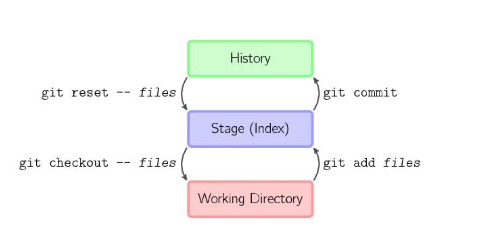
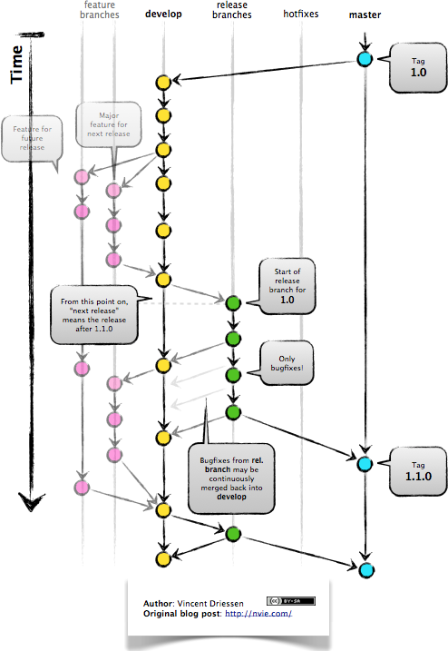

## 1、git 的三个组成部分

- 工作区：在 git 管理下的正常目录都算是工作区
- 暂存区：临时区域。里面存放将要提交文件的快照
- 历史记录区：git commit 后的记录区。

## 2、GitFlow 的各分支以及操作流程

## 3、撤销

- git reset：指向之前的一个 commit
  - --mixed：会影响到暂存区和历史记录区。也是默认选项；
  - --soft：只影响历史记录区；
  - --hard：影响工作区、暂存区和历史记录区
- git revert：目的等同于 git reset，但它会以创建新的 commit 的方式来撤销 commit，这样能保留之前的 commit 历史，比较安全。执行之前需要 commit 暂存区和工作区的更改。
- git checkout：可以将 HEAD 移到一个新的分支，并更新工作目录。执行之前需要 commit 暂存区和工作区的更改。

## 4、

- git rebase: 先找到两个分支最近的公共 commit，根据当前分支后续的 commit，生成一系列文件补丁，然后以被 rebase 的分支的最后一个 commit 记录为基点，逐个应用之前准备好的补丁文件，最后会生成一个新的合并 commit 对象。
- git merge: 把两个分支最新的快照以及二者最新的共同祖先进行三方合并，合并的结果是产生一个新的 commit 对象
- git cherry pick: 从公共分支创建一个新的分支，然后把自己原来个人分支的 commit 记录 cherry pick 到新的分支上

> 注意
> 1、因为 git reset 是直接删除 commit 记录，从而会影响到其他开发人员的分支，所以不要在公共分支（比如 develop）做这个操作。
> 2、一旦分支中的 commit 对象已经发布到公共仓库，就千万不要对该分支进行 rebase 操作，因为 rebase 是生成了新的 commit，这样其他人就需要重新再 rebase 一次…

## 5、删除最后的 commit

1. 查找 git 提交记录的 id
   > git log
2. 删除最后的提交
   > git reset --soft commit~3 // 只删除 commit，不删除修改内容
   > git reset --hard commit~3 // 删除提交记录并不保存所删除记录所做的更改
