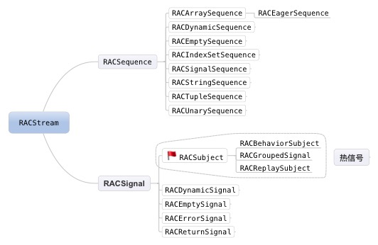
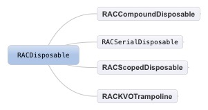
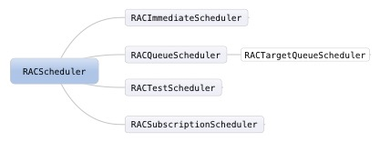

# 1、ReactiveCocoa

简称RAC，是在iOS平台上对FRP的实现。FRP的核心是信号，信号在ReactiveCocoa中是通过RACSignal来表示的，信号是数据流，可以被绑定和传递。

## 基本结构

1. 信号源，RACSignal及其子类



+ RACSequence: 是ReactiveCocoa里面的集合类，主要用来做数据处理
+ RACSignal: RAC的核心，

+ 冷信号：被动的，只有当你订阅的时候，它才会发布消息，只能一对一，当有不同的订阅者，消息是重新完整发送。
+ 热信号：主动的，即使没有订阅事件，但是它会时刻推送，可以有多个订阅者，是一对多，集合可以与订阅者共享信息

2. 清洁工，RACDisposable及其子类

负责对订阅关系的取消和相关资源的清理。



3. 调度器，RACScheduler及其子类

用来控制一个任务，何时何地被执行。它主要是用来解决ReactiveCocoa中并发编程的问题的。RACScheduler的实质是对GCD的封装，底层就是GCD实现的。




4. 订阅者，RACSubscriber及其子类

RACSubscriber 是一个抽象的概念，所有实现了 RACSubscriber 协议的类都可以作为信号源的订阅者

> RACSubscriber --> RACPassthroughSubscriber

5. RACCommand

RACCommand是对一个动作的触发条件以及它产生的触发事件的封装。

6. RACObserve

7. RACTuple

元组，RAC信号流数据的打包与解包

其他：
RACUnit、RACEvent、RACChannel --> RACKVOChannel、RACBlockTrampoline、RACKVOProxy、RACDelegateProxy、RACSubscriptingAssignmentTrampoline、RACEXTRuntimeExtensions

## 信号常用操作方法

1. 过滤
  + filter:过滤信号，使用它可以获取满足条件的信号.
  + ignore:忽略完某些值的信号.
  + distinctUntilChanged:当上一次的值和当前的值有明显的变化就会发出信号，否则会被忽略掉。
  + take:从开始一共取N次的信号
  + takeLast:取最后N次的信号,前提条件，订阅者必须调用完成，因为只有完成，就知道总共有多少信号.
  + takeUntil:(RACSignal *):获取信号直到某个信号执行完成
  + skip:(NSUInteger):跳过几个信号,不接受。
  + switchToLatest:用于signalOfSignals（信号的信号），有时候信号也会发出信号，会在signalOfSignals中，获取signalOfSignals发送的最新信号。

2. 组合
  + flattenMap map 用于把源信号内容映射成新的内容。
  + concat 组合 按一定顺序拼接信号，当多个信号发出的时候，有顺序的接收信号
  + then 用于连接两个信号，当第一个信号完成，才会连接then返回的信号。
  + merge 把多个信号合并为一个信号，任何一个信号有新值的时候就会调用
  + zipWith 把两个信号压缩成一个信号，只有当两个信号同时发出信号内容时，并且把两个信号的内容合并成一个元组，才会触发压缩流的next事件。
  + combineLatest:将多个信号合并起来，并且拿到各个信号的最新的值,必须每个合并的signal至少都有过一次sendNext，才会触发合并的信号。
  + reduce聚合:用于信号发出的内容是元组，把信号发出元组的值聚合成一个值

3. 其他
  + delay 延迟发送next。
  + retry重试 ：只要失败，就会重新执行创建信号中的block,直到成功.
  + replay重放：当一个信号被多次订阅,反复播放内容

## 常见问题

1. 冷信号如何转换成热信号？

通过 RACMulticastConnection 订阅 sourceSignal，使用 RACSubject 发送 sourceSignal 的结果实现的。具体方法如下：

```
- (RACMulticastConnection *)multicast:(RACSubject *)subject;  // 需要手动调用 connect
- (RACMulticastConnection *)publish;  // 通过 multicast 实现
- (RACSignal *)replay;                // 通过 RACReplaySubject、RACMulticastConnection 实现
- (RACSignal *)replayLast;
- (RACSignal *)replayLazily;
```

2. RAC中的RACObserve和KVO有什么区别

RACObserve最终还是通过NSObject的KVO实现的，只是添加了信号特征，更方便RAC的使用。RACObserve的实现层级为：

```
NSObject+RACPropertySubscribing
NSObject+RACKVOWrapper
RACKVOTrampoline
RACKVOProxy
```

3. RAC如何实现双向绑定？

通过RACChannel，由两个相互订阅的并发信号组成。方便使用的宏 `RACChannelTo`

```
RACChannelTo(view, property) = RACChannelTo(model, property);
```

# 2、AFNetworking

AFNetworking 是基于NSURLSessionTask进行封装，支持https，网络数据请求，文件上传，文件下载，监听手机网络状态。数据传递主要使用block 和 notifacation的方式。

+ AFURLSessionManager：对网络请求进行管理
+ AFURLRequestSerialization：对网络请求的Request进行封装
+ AFURLReponseSerialization：对响应体Reponse进行处理
+ AFSecurityPolicy：对服务器证书进行校验
  + AFSSLPinningModeNone：不做任何验证，只要服务器返回了证书就通过
  + AFSSLPinningModePublicKey：只验证公钥部分，只要公钥部分一致就验证通过
  + AFSSLPinningModeCertificate：除了公钥外，其他能容也要一致才能通过验证
+ AFHTTPSessionManager：继承AFURLSessionManager，包含AFURLRequestSerialization、AFURLReponseSerialization、AFSecurityPolicy，封装了http的get、post、put、delete

# 3、SDWebImage

1. 缓存

SDWebImage 的图片缓存采用的是 Memory 和 Disk 双重 Cache 机制，

加载图片机制:
Disk Cache 查询成功，还会把得到的图片再次设置到 Memory Cache 中

--> memory cacahe --> disk cache --> network 