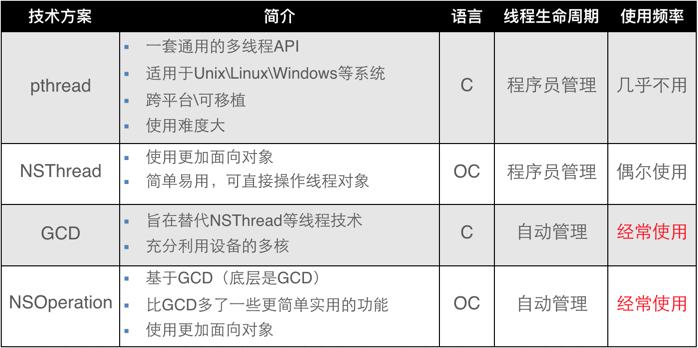
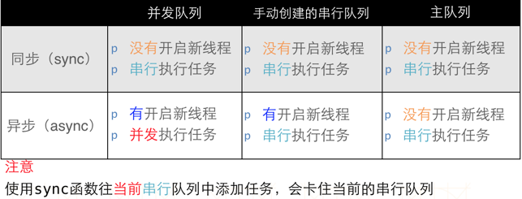

# 1、内存泄露

## ARC下常见的内存泄露

1. Delegate未使用weak

一定要注意将 delegate 变量声明为 weak 类型，如使用strong或别的类型修饰的话将会导致循环引用，导致dealloc()不会被调用。

2. Block持有self未使用弱引用

在 ARC 下，当 block 获取到外部变量时，由于编译器无法预测获取到的变量何时会被突然释放，为了保证程序能够正确运行，让 block 持有获取到的变量，然而，也正因 block 持有了变量，容易导致变量和 block 的循环引用，造成内存泄露！

3. NSTimer未调用[timer invalidate]

​NSTimer在VC释放前，一定要调用[timer invalidate]，不调用的后果就是NSTimer无法释放其target，如果target正好是self，则会导致引用循环。

## 三类内存泄露

1. Leaked memory

    Leaks 只能查找这类内存泄露，ARC下一般较少

2. Abandoned memory

    Allocations 一般用于查找这类内存泄漏，但是需要多次 push/pop 。

3. Cached memory

## MLeaksFinder

1. 原理

UIViewController 被 pop 或 dismiss 后，该 UIViewController 包括它的 view，view 的 subviews 等等将很快被释放

2. 实现

基类NSObject 添加一个方法 -willDealloc，先用一个弱指针指向 self ，3s后，监测view、subviews是否被释放了。如果全部释放，则弱引用指向nil，如果没有，直接断言

3. 具体实现

+ 使用AOP技术，不入侵开发代码
+ 递归遍历 UIViewController 的 presentedViewController 和 view，UIView 的 subviews
+ 排除单例，系统View

# 2、KVC 与 KVO

## KVC

key-value-coding,即键值编码，通常是用来给某一个对象的属性进行赋值。

常见用法

+ 对私有变量进行赋值，例如修改 UIPageControl 的 image 
+ 字典转模型

实现原理

  1. 查找 Model 中是否有 set 方法，如有、直接调用赋值
  2. 查找 Model 是否有私有变量（__XX），如有，使用__XX=""赋值
  3. 查找 Model 是否有外部属性（XX），如有，使用XX=""赋值
  4. 如果都找不到，则报错

## KVO 

key-value-observing,利用一个key来找到某个属性并监听其值得改变。


当监听一个类的属性时，系统会为该类派生一个新类，并在该派生类中重写被监听属性的setter方便，并且该类的 isa 指针指向派生类。重写的setter方法会在调用原setter方法前后，通知观察对象值得改变。

# 3、iOS多线程

## 3.1 基本概念

+ 进程: 进程是指在系统中正在运行的一个应用程序，每个进程之间是独立的，每个进程均运行在其专用且受保护的内存空间内
+ 线程：1个进程要想执行任务，必须得有线程，一个进程（程序）的所有任务都在线程中执行
+ 多线程：1个进程中可以开启多条线程，每条线程可以并行（同时）执行不同的任务，多线程技术可以提高程序的执行效率

#### 进程与线程

1. 线程是CPU调用(执行任务)的最小单位。
2. 进程是CPU分配资源的最小单位。
3. 一个进程中至少要有一个线程。
4. 同一个进程内的线程共享进程的资源。

#### 并发与并行

1. 并发指的是一种现象，一种经常出现，无可避免的现象。它描述的是“多个任务同时发生，需要被处理”这一现象。它的侧重点在于“发生”。
2. 并行指的是一种技术，一个同时处理多个任务的技术。它描述了一种能够同时处理多个任务的能力，侧重点在于“运行”。

#### 多线程优缺点

1. 优点：能适当提高程序的执行效率，能适当提高资源利用率（CPU、内存利用率）
2. 缺点：创建线程是有开销的，如果开启大量的线程，会降低程序的性能，线程越多，CPU在调度线程上的开销就越大。

> iOS下主要成本包括：内核数据结构（大约1KB）、栈空间（子线程512KB、主线程1MB，也可以使用-setStackSize:设置，但必须是4K的倍数，而且最小是16K），创建线程大约需要90毫秒的创建时间

## 3.2 实现方案实现方案



#### GCD

1. 任务：执行什么操作，任务有两种执行方式： 同步函数 和 异步函数
  + 同步：阻塞当前线程，不能开辟新线程
  + 异步：不阻塞当前线程，能开辟新线程，但不一定会开辟
2. 队列：用来存放任务，分为串行队列 和 并行队列
  + 串行：让任务一个接着一个地执行
  + 并行：可以让多个任务并发（同时）执行



> 注意：同步函数+主队列：会产生死锁

```
dispatch_queue_t queue =  dispatch_get_main_queue();
dispatch_sync(queue, ^{
  NSLog(@"---download1---%@",[NSThread currentThread]);
});
```

> dispatch_once如何保证once?

#### NSOperation

NSOperation 是苹果公司对 GCD 的封装，完全面向对象。

NSOperationQueue支持KVO, 可以监测operation是否正在执行、结束、取消
NSOperationQueue可以通过调整权重调整队列的执行顺序

> 暂停和取消只能暂停或取消处于等待状态的任务，不能暂停或取消正在执行中的任务.

#### NSOperation Vs GCD

+ NSOperation: 各个操作之间有依赖关系、操作需要取消暂停、并发管理、控制操作之间优先级，限制同时能执行的线程数量.让线程在某时刻停止/继续等。
+ GCD: 一般的需求很简单的多线程操作，用GCD都可以了，简单高效

## 3.3 线程安全

[线程锁](https://bestswifter.com/ios-lock/)

1. 互斥锁：一种用来防止多个线程同一时刻对共享资源进行访问的信号量，它的原子性确保了如果一个线程锁定了一个互斥量，将没有其他线程在同一时间可以锁定这个互斥量。
2. 递归锁：可以被一个线程多次获得，而不会引起死锁，它记录了成功获得锁的次数，每一次成功的获得锁，必须有一个配套的释放锁和其对应，这样才不会引起死锁。
3. 条件锁：一个线程被某一个条件所阻塞，直到另一个线程满足该条件从而发送信号给该线程使得该线程可以正确的执行。
4. 信号量：在进入一段代码前，必须获得一个信号量，在结束代码前，必须释放该信号量。
5. 自旋锁：当一个线程获得锁之后，其他线程将会一直循环在哪里查看是否该锁被释放。

+ OSSpinLock：自旋锁，如不能保证访问资源的优先级都在统一水平，则弃用
+ os_unfair_lock：为了解决自旋锁的优先级反转问题而出现的
+ dispatch_semaphore：信号量
+ pthread_mutex：互斥锁，支持递归
+ pthread_rwlock：读写锁
+ NSLock：互斥锁、对象锁
+ NSCondition：条件锁、对象锁
+ NSConditionLock：条件锁、对象锁
+ NSRecursiveLock：递归锁、对象锁
+ @synchronized：互斥锁，便捷但是效率最低，通过牺牲性能换来语法上的简洁与可读

线程锁使用总结

+ 当进行文件读写的时候，使用 pthread_rwlock 较好，文件读写通常会消耗大量资源，而使用互斥锁同时读文件的时候会阻塞其他读文件线程，而 pthread_rwlock 不会。
+ 当性能要求较高时候，可以使用 pthread_mutex 或者 dispath_semaphore，由于 OSSpinLock 不能很好的保证线程安全，而在只有在 iOS10 中才有 os_unfair_lock ，所以，前两个是比较好的选择。既可以保证速度，又可以保证线程安全。
+ 对于 NSLock 及其子类，速度来说 NSLock > NSCondition > NSRecursiveLock > NSConditionLock 。

## 3.4 常见问题

1. 如何确保线程A/B执行完成在执行线程C

> 1、使用dispatch_barrier_async，2、使用dispatch_group

2. 3个异步的不同线程都得网络请求，如何在都返回时再更新UI

> 1、RAC的zip，2、GCD的dispatch_group，3、GCD的dispatch_semaphore，4、NSOperationQueue

# 4、[RunTime](https://www.ianisme.com/ios/2019.html)

## 4.1 基本元素

+ id：实例对象，数据结构为objc_object
+ Class：类对象，数据结构为objc_class
+ SEL：selector在Objective-C中的表示类型。selector可以理解为区别方法的ID。
+ IMP：由编译器生成的一个函数指针。这个函数指针决定了最终执行哪段代码。
+ Methord：类中的某个方法的类型
+ Ivar：类中实例变量的类型
+ objc_property：类的属性
+ Cache：缓存
+ Catagory：类别

1. 关于`/Public Headers/objc.h`

```
#if !OBJC_TYPES_DEFINED
/// An opaque type that represents an Objective-C class.
typedef struct objc_class *Class;

/// Represents an instance of a class.
struct objc_object {
    Class isa  OBJC_ISA_AVAILABILITY;
};

/// A pointer to an instance of a class.
typedef struct objc_object *id;
#endif
```

+ Class：指向objc_class结构体的指针
+ id：指向objc_object结构体的指针
+ isa：id其中的isa指向objc_class结构体的指针

2. 关于`/Public Headers/runtime.h`

```
typedef struct objc_class *Class;
struct objc_class { 
 Class isa                                 OBJC_ISA_AVAILABILITY; // metaclass
#if !__OBJC2__
 Class super_class                         OBJC2_UNAVAILABLE; // 父类
 const char *name                          OBJC2_UNAVAILABLE; // 类名
 long version                              OBJC2_UNAVAILABLE; // 类的版本信息，默认为0，可以通过runtime函数class_setVersion或者class_getVersion进行修改、读取
 long info                                 OBJC2_UNAVAILABLE; // 类信息，供运行时期使用的一些位标识，如CLS_CLASS (0x1L) 表示该类为普通 class，其中包含实例方法和变量;CLS_META (0x2L) 表示该类为 metaclass，其中包含类方法;
 long instance_size                        OBJC2_UNAVAILABLE; // 该类的实例变量大小（包括从父类继承下来的实例变量）
 struct objc_ivar_list *ivars              OBJC2_UNAVAILABLE; // 该类的成员变量地址列表
 struct objc_method_list **methodLists     OBJC2_UNAVAILABLE; // 方法地址列表，与 info 的一些标志位有关，如CLS_CLASS (0x1L)，则存储实例方法，如CLS_META (0x2L)，则存储类方法;
 struct objc_cache *cache                  OBJC2_UNAVAILABLE; // 缓存最近使用的方法地址，用于提升效率；
 struct objc_protocol_list *protocols      OBJC2_UNAVAILABLE; // 存储该类声明遵守的协议的列表
#endif
}
/* Use `Class` instead of `struct objc_class *` */
```
    
+ isa

objc_class（类对象，即类）中的 isa 指向的是 metaclass，存放着static变量和方法（“+”开头的方法）。
objc_object（实例对象，即对象）中的 isa 指向的结构是 Class，存放着普通成员变量和方法（“-”开头的方法）。

+ super_class

指向该类的父类的指针，如果该类是根类（如NSObject或NSProxy），那么super_class就为nil。

+ 类与对象的继承关系

所有的metaclass中isa指针都是指向根metaclass，而根metaclass则指向自身。根metaclass是通过继承根类产生的，与根class结构体成员一致，不同的是根metaclass的isa指针指向自身。


## 4.2 消息传递

+ 基本消息传递

objc_msgSend函数的调用过程
1. 监测selector是否要被忽略
2. 监测target是否为nil
3. 区分实例方法和类方法
    实例方法：首先在自身 isa 指向类的 methordLists 中查找该方法，如果没有，则从父类的 methordList 中查找，直到根类
    类方法：首先从自身 isa 指向的metaclass 的 methordList 中查找该方法，如果没有，则从super_class指向的父类的 metaclass 的 methorList中 查找，直到根类的metaclass
4. 如果都找不到，进入动态分析过程

+ [消息动态解析](https://blog.csdn.net/xiaozhuanddapang/article/details/62336072)
 
1. 动态方法解析，征询接收者，看其是否能动态添加方法，来处理当前这个未知的Selector(resolveInstanceMethod)
2. 进入消息转发流程重定向(forwardingTargetForSelector)
3. 生成方法签名，然后系统用这个方法签名生成NSInvocation对象(methodSignatureForSelector)
4. 改变Selector(forwardInvocation)


## 4.3 常见用途

1. 动态的添加对象的成员变量和方法(class_addMethod)
2. 动态交换两个方法的实现(method_exchangeImplementations)
3. 实现分类(Categary)也可以添加属性(objc_setAssociatedObject /objc_getAssociatedObject)
4. 实现字典转模型的自动转换
5. 实现 NSCoding 的自动归档和解档

## 4.4 [Category](https://tech.meituan.com/DiveIntoCategory.html)

1. 数据结构如下

```
typedef struct category_t {
    const char *name;
    classref_t cls;
    struct method_list_t *instanceMethods;
    struct method_list_t *classMethods;
    struct protocol_list_t *protocols;
    struct property_list_t *instanceProperties;
} category_t;
```
从category的定义也可以看出，可以添加实例方法，类方法，属性，实现协议，但是无法添加实例变量。

> 如果Category和原来的类都有方法MethodA，那么category附加完成，类的方法列表会有两个 MethodA 方法，只是category 的 methodA 放在原来类的 methodA 的前边 

2. 作用

+ 为已经存在的类添加方法
+ 把类的实现分开在几个不同的文件里面
+ 声明私有方法

3. Category 与 Extension

+ extension：编译期决议，可以添加实例变量
  + 它就是类的一部分，在编译期和头文件以及实现文件一起形成一个完整的类，与类共存亡。
  + 一般用来隐藏类的私有信息，
  + 必须有一个类的源码才能为一个类添加extension
+ Category：运行期决议，不可以添加实例变量。因为在运行期，对象的内存布局已经确定，如果添加实例变量就会破坏类的内部布局，这对编译型语言来说是灾难性的

# 5、[Block](https://blog.ibireme.com/2013/11/27/objc-block/)

block的实现原理是C语言的函数指针，即函数在内存中的地址,通过这个地址可以达到调用函数的目的。Block是NSObject的子类,拥有NSObject的所有属性,所以block对象也有自己的生命周期,生存期间也会被持有和释放。栈上的 block 在 ARC 下会自动复制到堆上

## 5.1 Block的数据结构

```
struct Block_descriptor_1 {
    uintptr_t reserved;
    uintptr_t size;                     // Block总体大小
    void (*)(void *, void *) copy;      // 辅助函数指针，Block copy时执行
    void (*)(void *, void *) dispose;   // 辅助函数指针，Block dispose时执行
};
 
struct Block_layout {
    void *isa;                          // 指向持有该Block的Class
    volatile int32_t flags;             //
    int32_t reserved;                   //
    void (*invoke)(void *, ...);        // 指向Block的实现代码
    struct Block_descriptor_1 *descriptor;

    // 其他Block捕获到的变量，这里只是变量的指针
};
```

在存放Block对象的内存里，收个变量是指向Class的指针，即isa。


## 5.2 相关关键字

+ __block: Block内改变Block外部的值，局部变量栈 --> 堆，[__block的具体含义](https://www.jianshu.com/p/a41396ff0247)
```
__block int a = 2;          // 局部变量定义在栈中
void (^foo)() = ^{
    a = 3;                  // 从栈拷贝到堆中
};
foo();
```
+ typedef: Block重命名，使用更简单

```
typedef void (^AAACompletionHandler)(NSData *data, NSError *error);
- (void)startWithHandler:(AAACompletionHandler)handler; // 内联Block
```

## 5.3 Block的种类

1. NSGlobalBlock，静态区block

    + 这是一种特殊的bloclk，因为不引用外部变量而存在
    + 出栈时释放，且未引用外部变量，即非栈区block
    + 宿主target销毁时释放，且未引用外部变量，即非堆区block

2. NSStackBlock，栈区block
    
    + 位于内存的栈区，一般作为函数的参数出现
    + 会引用block外部变量

3. NSMallocBlock，堆区block

    + 位于内存的堆区，一般作为对象的property出现
    + 在MRC时代使用Block_copy()方法,可以将blcok复制到堆中。

## 5.4 常见问题

1. weakSelf 为什么需要strongSelf配合使用

> 为了避免在block的执行过程中，突然出现self被释放的尴尬情况

2. 什么情况下block不需要使用weakSelf

> 当block本身不被self持有，而被别的对象持有，同时不产生循环引用的时候，就不需要weakSelf，例如UIView的animateWithDuration:就不需要使用weakSelf

3. 什么情况下未循环引用，需要使用weakSelf、strongSelf

> 回调使用self时，self可能被销毁，例如网络请求、异步延时执行的回调

4. block嵌套block还用__strong两遍吗

> 需要，有可能会被释放

[iOS Block源码分析系列（一）————2分钟明白Block究竟是什么？](https://blog.csdn.net/deft_mkjing/article/details/53143076)

[iOS Block源码分析系列（二）————局部变量的截获以及__block的作用和理解](https://blog.csdn.net/deft_mkjing/article/details/53149629)

[iOS Block源码分析系列（三）————隐藏的三种Block本体以及为什么要使用copy修饰符](https://blog.csdn.net/deft_mkjing/article/details/53165799)

[iOS Block源码分析系列（四）————__block和Block的循环引用](https://blog.csdn.net/deft_mkjing/article/details/53178040)


# 6、[消息传递机制](https://www.objccn.io/issue-7-4/)

## KVO

提供对象属性被改变时的通知的机制，被传递的消息可以被当成值的改变来处理。

## Notification

在代码中的两个不相关的模块中传递消息时，通知机制是非常好的工具。一对多、单向的

## Delegate

运行成本低，只是保存了一个对象指针，直接回调，没有额外消耗。发送者需要知道接收者

## Block

block成本很高，出栈需要将使用的数据从栈内存拷贝到堆内存。异步的简单的回调用block更好

## Target-Action

UI 中消息传递的最佳选择

# 7、类方法load和initialize的区别

1. +load

  + 不遵循继承规则
  + 不管这个类有没有被调用，只要它被装载，那么它就会运行这个方法
  + 调用顺序是：SuperClass --> SubClass --> SuperCategaryClass --> SubCategaryClass
  + 不管子类有没有写[super load]方法，父类的load都只会执行一次
  + 线程安全

2. +initialize

  + 遵循继承规则
  + initialize最多会调用一次
  + 第一次收到消息的时候触发，也就是第一次调用该类的时候才会触发
  + 不需要显式的调用 [super initialize]，否则父类会执行多次
  + 如果分类实现了initialize，则不会调用该类的initialize
  + 线程安全

> 注意:
Load方法是在类加载的时候调用的，是在类加载到运行时的时候调用的，在main函数之前，所以比较适合在load中调用钩子方法,只调用一次。		
因为加载的时候，无法判断加载顺序，所以最好不要在里面调用其他的自定义类的方法，NSLog没问题，因为Foundation框架肯定在运行load方法之前就已经载入系统了。


# 8、内存管理

## 8.1 常见关键字

ARC下set方法会先保留新值，再释放旧值，最后设置实例变量。

+ strong: 指向并拥有该对象
+ weak: 指向但不拥有该对象
+ assign: 用于修饰基本数据类型，这些数值主要存在于栈上
+ copy: 一般用在修饰有可变对应类型的不可变对象上，如NSString, NSArray, NSDictionary。
+ atomatic: 线程安全，速度慢，保证setter和getter的完整性
+ nonatomic: 线程不安全，速度快，不保证setter和getter的完整性
+ __strong:默认保留此值；
+ __weak：不保留此值，但是变量可以安全使用，因为如果系统把这个对象回收了，那么变量也会自动清空。
+ __unsafe_unretained：不保留此值，这么做可能不安全，因为等到再次使用变量时，其对象可能已经回收了。
+ __autoreleasing：把对象按引用传递给方法时，使用这个特殊的修饰符，此值在方法返回时自动释放。
+ __block: 用于修饰某些block内部将要修改的外部变量。

> weak与assign: weak 一般用来修饰对象，assign一般用来修饰基本数据类型。原因是assign修饰的对象被释放后，指针的地址依然存在，造成野指针，在堆上容易造成崩溃。而栈上的内存系统会自动处理，不会造成野指针。

> copy与strong：不同之处是strong的复制是多个指针指向同一个地址，而copy的复制每次会在内存中拷贝一份对象，指针指向不同地址。

> __weak与weak：__weak修饰变量，weak修饰属性

> weak与unowned：weak 和 unowned 的引入是为了解决由 strong 带来的循环引用问题。一般而言，当访问对象时该对象可能已经被释放了，则用 weak，比如 delegate 的修饰；当访问对象确定不可能被释放，则用 unowned，比如 self 的引用。

## 8.2 autorelease pool

autoreleasepool 是没有单独的内存结构的，它是通过以 AutoreleasePoolPage 为结点的双向链表来实现的。

+ 每一个线程的 autoreleasepool 其实就是一个指针的堆栈，这个堆栈被划分成了一个以 page 为结点的双向链表。pages 会在必要的时候动态地增加或删除；
+ 每一个指针代表一个需要 release 的对象；

autoreleasepool 运行过程

+ push：创建一个新的 autoreleasepool，对应 AutoreleasePoolPage 的具体实现就是往 AutoreleasePoolPage 中的 next 位置插入一个 POOL_SENTINEL ，并且返回插入的 POOL_SENTINEL 的内存地址。
  + 当前 page 存在且没有满时，直接将对象添加到当前 page 中，即 next 指向的位置；
  + 当前 page 存在且已满时，创建一个新的 page ，并将对象添加到新创建的 page 中；
  + 当前 page 不存在时，即还没有 page 时，创建第一个 page ，并将对象添加到新创建的 page 中。
+ autorelease：跟push 操作的实现非常相似。只不过 push 操作插入的是一个 POOL_SENTINEL ，而 autorelease 操作插入的是一个具体的 autoreleased 对象
+ pop：参数就是 push 函数的返回值，也就是 POOL_SENTINEL 的内存地址，即 pool token 。当执行 pop 操作时，内存地址在 pool token 之后的所有 autoreleased 对象都会被 release 。直到 pool token 所在 page 的 next 指向 pool token 为止

NSThread、NSRunLoop 和 NSAutoreleasePool

+ 每个NSRunLoop开始前，系统会自动创建一个 autoreleasepool ，并在 event loop 结束时 drain 。
+ 每一个线程都会维护自己的 autoreleasepool 堆栈

autorelease 和 autorelease pool

+ autorelease：把对象放到离自己最近的自动释放池，当自动释放池销毁的时候才会release
+ autorelease pool：只有栈顶的池子是活动的，池子出栈时所有其中的对象会进行一个release操作。

## 8.3 常见问题？

1. 何时释放

autoreleased 对象是被添加到了当前的 autoreleasepool 中，只有当这个 autoreleasepool 自身 drain 的时候，autoreleasepool 中的 autoreleased 对象才会被 release 。

2. 如何释放

调用AutoreleasePoolPage的pop操作释放

3. 一般使用线程自动创建autoreleasepool，何时需要手动管理

+ 编写的程序不是基于 UI 框架的，比如说命令行工具；
+ 编写的循环中创建了大量的临时对象；
+ 创建了一个辅助线程，非cocoa创建的一些线程

4. 为什么有了ARC还要Autorelease Pool？

> ARC就是编译器自动添加retain/release/autorelease等语句，保证引用计数的正确性；@autoreleasepool 可以帮助我们自动回收内存，autoreleasepool可以有效避免内存峰值

