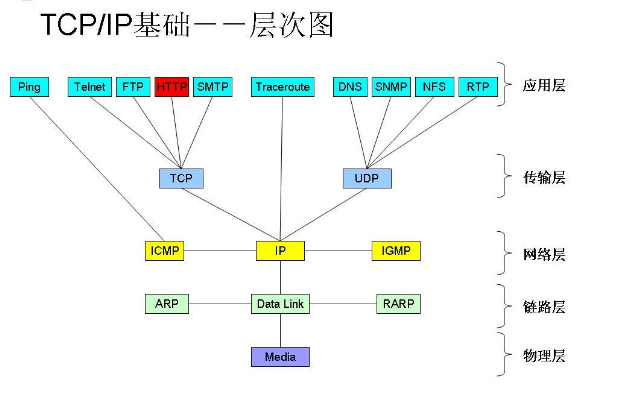
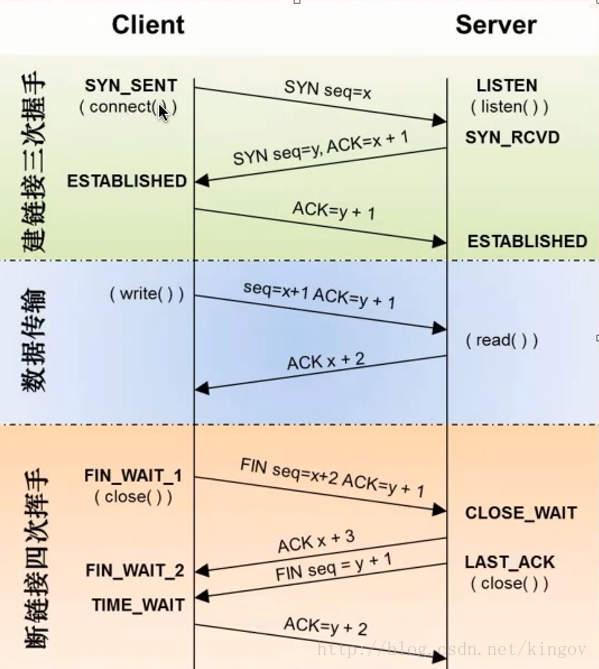

# 1、[Http](https://mp.weixin.qq.com/s/GICbiyJpINrHZ41u_4zT-A)

HTTP属于应用层协议，在传输层使用TCP协议，在网络层使用IP协议。 IP协议主要解决网络路由和寻址问题，TCP协议主要解决如何在IP层之上可靠地传递数据包，使得网络上接收端收到发送端所发出的所有包，并且顺序与发送顺序一致

## 1.1 OSI七层结构

+ 物理层
+ 数据层
+ 网络层：ip
+ 传输层：tcp、udp
+ 会话层
+ 表示层
+ 应用层：ftp、http

TCP/IP五层模型

## 1.2 三次握手、四次挥手

TCP提供可靠的传输层协议，有六种标志位：SYN(synchronous建立联机) ACK(acknowledgement 确认) PSH(push传送) FIN(finish结束) RST(reset重置) URG(urgent紧急)

三次握手

客户端向服务器发请求，服务器接收请求，服务器接收请求之后发送一个连接标志，客户端接收连接标志之后也向服务器发送一个连接标志，至此连接完成

1. 客户端发送SYN(syn=i)请求，要求建立连接，并进入 SYN_SEND 状态；
2. 服务器收到主机A的SYN请求，必须确认ACK(ack=i+1)，同时发送一个服务器的SYN(syn=j)请求，即 SYN+ACK 包，进入SYN_RECV状态；
3. 客户端收到服务器的SYN＋ACK包，向服务器发送确认包ACK(ack=j+1)，此包发送完毕，客户端和服务器进入ESTABLISHED状态，完成三次握手

四次挥手

4次挥手的作用就是断开连接，之所以要断开连接是因为TCP/IP协议是要占用端口的，而计算机的端口是有限的，所以一次传输完成之后是要断开连接的，断开连接的方式就是4次挥手。 

1. 客户端A发送一个FIN.用来关闭客户A到服务器B的数据传送
2. 服务器B收到这个FIN. 它发回一个ACK，确认序号为收到的序号+1。和SYN一样，一个FIN将占用一个序号
3. 服务器B关闭与客户端A的连接，发送一个FIN给客户端A
4. 客户端A发回ACK报文确认，并将确认序号设置为序号加1

## 1.3 Http的工作过程

1. 地址解析
  
从url中分解中协议名、主机名、端口号、对象路劲，如http://localhost.com:8080/index.html,可分解为
  + 协议名：http
  + 主机名：localhost.com，这里需要域名DNS解析，得到主机的IP
  + 端口号：8080
  + 对象路劲：/index.html

2. 封装Http请求包

3. 封装成TCP包，建立TCP连接

4. 客户端发送请求命令

5. 服务器相应

6. 服务器关闭TCP连接

如果http头部加入 Connection:keep-alive ，则服务器相应完成不会立即关闭TCP连接。

## 1.4 HTTP 1.1 HTTP 2.0主要区别

1. 数据格式

HTTP1.x的解析是基于文本，HTTP2.0的协议解析决定采用二进制格式，实现方便且健壮

2. 多路复用

同一个连接并发处理多个请求，而且并发请求的数量比HTTP1.1大了好几个数量级。

3. 数据压缩

HTTP1.1不支持header数据的压缩，HTTP2.0使用HPACK算法对header的数据进行压缩

4. 服务器推送

对支持HTTP2.0的web server请求数据的时候，服务器会顺便把一些客户端需要的资源一起推送到客户端，免得客户端再次创建连接发送请求到服务器端获取

## 1.5 Http的 Request 和 Response

## 1.6 Https

+ HTTPS协议需要到CA申请证书，一般免费证书很少，需要交费。
+ HTTP协议运行在TCP之上，所有传输的内容都是明文，HTTPS运行在SSL/TLS之上，SSL/TLS运行在TCP之上，所有传输的内容都经过加密的。
+ HTTP和HTTPS使用的是完全不同的连接方式，用的端口也不一样，前者是80，后者是443。
+ HTTPS可以有效的防止运营商劫持，解决了防劫持的一个大问题。

#### 1.6.1 SSL/TLS运行机制

+ 客户端发出请求。客户端主要向服务器提供以下信息:
  + 支持的协议版本，比如TLS 1.0版。
  + 一个客户端生成的随机数，稍后用于生成”对话密钥”
  + 支持的加密方法，比如RSA公钥加密
  + 支持的压缩算法
+ 服务器回应。服务器的回应包含以下内容:
  + 确认使用的加密通信协议版本;
  + 一个服务器生成的随机数，稍后用于生成”对话密钥”;
  + 确认使用的加密方法，比如RSA公钥加密;
  + 数字证书
+ 客户端回应:首先验证服务器证书,然后，向服务器发送下面三项信息:
  + 一个随机数(pre-master key)。
  + 编码改变通知，表示随后的信息都将用双方商定的加密方法和密钥发送
  + 客户端握手结束通知，表示客户端的握手阶段已经结束。这一项同时也是前面发送的所有内容的hash值，用来供服务器校验。
+ 服务器的最后回应:
  + 编码改变通知，表示随后的信息都将用双方商定的加密方法和密钥发送.
  + 服务器握手结束通知，表示服务器的握手阶段已经结束。这一项同时也是前面发送的所有内容的hash值，用来供客户端校验。

#### 1.6.2 TSL/SSL的工作原理

#### 1.6.3 相关加密算法

+ 非对称加密算法
  + [RSA](https://blog.csdn.net/Jolie_Yang/article/details/52034139)：是一个支持变长密钥的公共密钥算法，需要加密的文件块的长度也是可变的
  + DSA: 数字签名算法，是一种标准的 DSS（数字签名标准）
  + ECC: 椭圆曲线密码编码学

+ 对称加密算法
  + DES: 数据加密标准，速度较快，适用于加密大量数据的场合
  + AES: 高级加密标准，是下一代的加密算法标准，速度快，安全级别高

+ 哈希算法
  + md5: 加密后长度为32 
  + SHA: 包括SHA1,SHA224,SHA256,SHA384,SHA512,长度分别为40,56,64，96，128

## 1.7 WebSocket

WebSocket 是一种网络通信协议，是 HTML5 开始提供的一种在单个 TCP 连接上进行全双工通讯的协议。websocket握手需要借助于http协议，建立连接后通信过程使用websocket协议

## 1.8 DNS优化

1. [DNS预解析](https://help.aliyun.com/document_detail/30144.html)

避免由于运营商传统LocalDns解析导致的无法访问最佳接入点的方案，在进行证书校验时，将IP替换成原来的域名，再进行证书验证。如阿里的DNS预解析方案(HttpDNS)。

2. [IP直连](https://www.jianshu.com/p/63a94cb46cd2)

+ 防劫持，可以绕过运营商 LocalDNS 解析过程，避免域名劫持，提高网络访问成功率
+ 降低延迟，DNS 解析是一个相对耗时的工作，跳过这个过程可以降低一定的延迟
+ 精准调度，运营商解析返回的节点不一定是最优的，自己获取 IP 可以基于自己的策略来获取最精准的、最优的节点

# 2、 常见图片格式的区别

+ jpg：与jpeg一样，
+ png：⽤用于全透明(保存png24)图⽚片，该格式是多数⽤用于小型格式的图片，不然文件会很大
+ gif：gif是用于网络图片，可以制作成带有帧的动画图片，图片文件比较小，同时颜色也不是很丰富，不建议用于带简便的图片，除了颜色很浅很简单的切片；
+ bmp：一般是windows保存的高保真图片，图片很大；
+ tiff：一般用于印刷图片，平面设计可以保存格式并发送给制作部门制作实物，图片也一般较大； 
+ ai、cdr、eps：矢量图形，根据自己的使用习惯，可以调整，并没有特别的界限；

# 3、 git vs. svn
+ svn：集中式，服务器故障无法操作，因为所有操作都需要与服务器交互
+ git：分布式，服务器故障除push/pull之外都可操作，安全性较高，每个开发者的本地就是一套完整版本库，记录着版本库的所有信息

# 4、 LLVM vs. Clang

+ LLVM: C++编写
  + 用于优化以任意程序语言编写程序的编译时间(compile-time)、链接时间(link-time)、运行时间(run-time)以及空闲时间(idle-time)，对开发者保持开放，并兼容已有脚本。
  + 负责代码优化、生成⽬标程序

+ Clang：基于LLVM，C++编写
  + Clang是一个高度模块化开发的轻量量级编译器器，它的编译速度快、占⽤用内存⼩小、非常方便进⾏⼆次开发。
  + 负责词法分析、语法分析、语义分析、生成中间代码